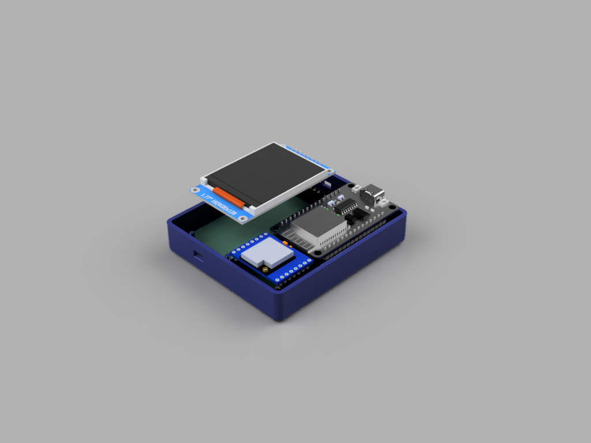

# Monitor de potencia con Esp32, LoRa y LCD TFT 1.77"

Este proyecto consiste en un sistema de monitoreo de potencia eléctrica que utiliza un **ESP32** para recepcionar datos de corriente y voltaje
a través de un módulo **LoRa** para luego calcular la potencia consumida.
Se incluyen los diseños del circuito y la PCB realizados en **KiCAD**, y el modelo 3D del dispositivo en **Fusion 360**.

## Componentes principales

- ESP32 (Se usó la versión de 30 pines con conector tipo C).
- LoRa SX1278 RA02.
- LCD TFT 1.77".

## Archivos incluidos

- Codigo: Sketch Arduino
- Diseño PCB: Proyecto KiCad
- Modelos CAD: Archivo Fusion 360

## Problemas y Futuras mejoras

- Debido al intensivo uso del puerto SPI a causa del display LCD, se tuvo que usar puertos diferentes,
el puerto principal para el display y el puerto HSPI para el modulo LoRa, se modificó la libreria
LoRa de sandeepmistry para poder utilizar el puerto HSPI. En el futuro se buscará mejorar esto y poder 
usar un solo puerto para los dos perifericos.

- En el aspecto del diseño mecanico del enclosure, se intentó diseñar los anclajes por medio de tornillos
y roscas M3. Al momento de imprimir no salieron bien tales cuerpos y no pudo cumplir su función. Se replanteará
el diseño para algo más robusto, ya que los anlcajes a presión también son débiles.
